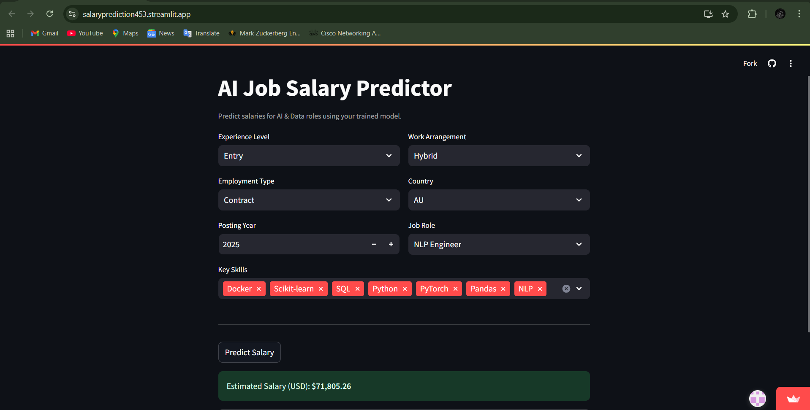

# 💼 Salary Prediction Web App  

  

🔗 **Live Website:** [Click here to visit](https://housepricepredictionapp123.streamlit.app/)  

---

## 📌 Project Overview  
In today’s competitive job market, predicting salaries based on skills, experience, education, and job roles can help both job seekers and employers make informed decisions.  

This project uses **Machine Learning** to build a model that predicts employee salaries from job-related data.  
The model is deployed on **Streamlit Cloud**, making it accessible through a simple, interactive web interface.  

---

## 🚀 Features  
- User-friendly Streamlit Web App  
- Predicts salaries based on input features  
- Clean, interactive UI with real-time results  
- Deployed online for easy access  

---

## 📊 Tech Stack  
- **Python** (Pandas, NumPy, Scikit-learn)  
- **Streamlit** (for UI & deployment)  
- **Matplotlib / Seaborn** (for visualization)  

---

## ⚡ How to Run Locally  
1. Clone the repository:  
   ```bash
   git clone https://github.com/your-username/your-repo-name.git
   cd your-repo-name